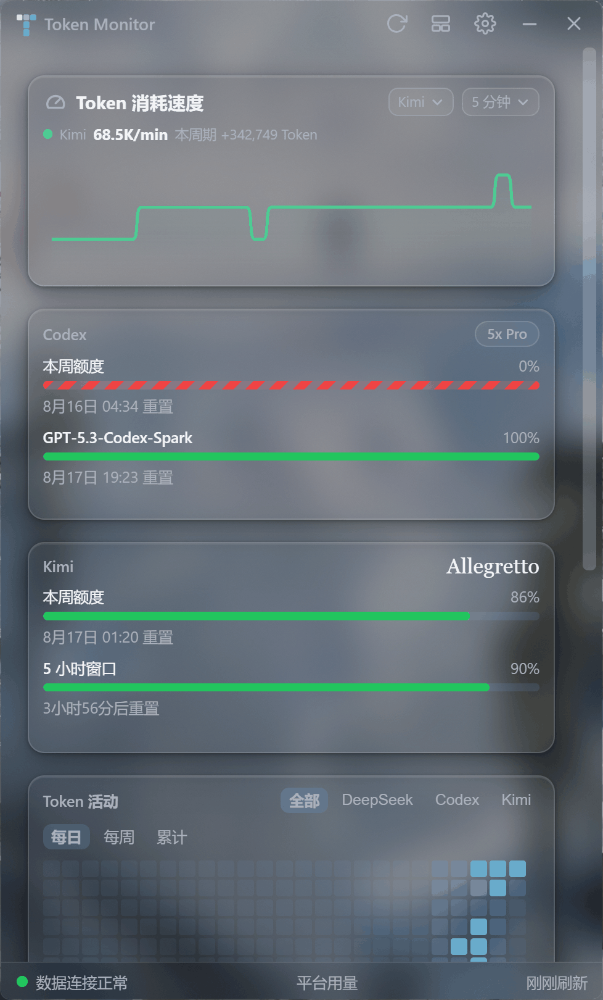
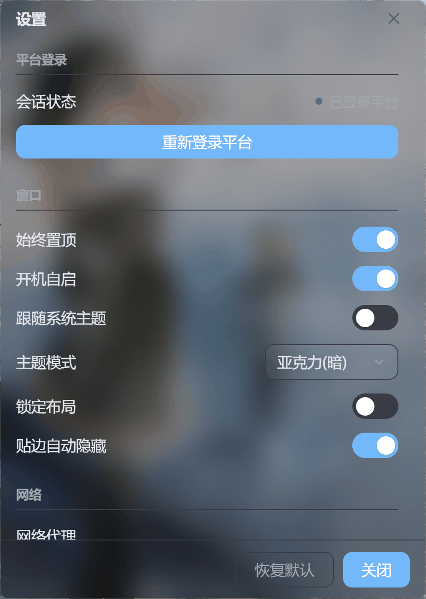

# Token Monitor

[中文](README.md) | **English**

A multi-platform AI usage monitor as a desktop floating widget — track quotas, balances and token consumption of **DeepSeek**, **Codex (OpenAI)** and **Kimi** in a single window.



## Recent Updates

- **Edge Auto Hide** (2026-08): drag the window to the left, right or top screen edge to dock it; it collapses to a thin trigger strip and slides back out on hover with a damped animation. Dragging undocks instantly, tray wake / opening settings fully expands it, and the dock state is restored after restart.
- **Read-only credential reuse** (2026-08): Codex / Kimi credentials are now read-only views of the local CLI credential files, eliminating the refresh_token rotation race with the CLI; also fixed false "session expired" flashes during the CLI's refresh window.
- **Proxy UX** (2026-08): custom proxy IP / port fields are pre-filled (auto-detecting the current system proxy port, or the last used value).
- **Themed dropdowns for the token-speed card** (2026-08): provider / time-window selectors now use the same CustomSelect as the settings page, and menus are no longer clipped by the card.

## Features

### Platform Quota Board

- **Codex**: weekly quota and per-model windows (e.g. GPT-5.3-Codex-Spark), plan badge (e.g. `5x Pro`), reset countdown.
- **Kimi**: weekly quota and 5-hour window, plan name badge (e.g. Allegretto), reset countdown.
- **DeepSeek**: balance, today's cost and cache-hit-rate stat cards.

### Charts

- **Cost trend**: daily cost bars + cumulative curve.
- **Token consumption trend**: output / cache-hit / cache-miss stacked.
- **DeepSeek daily tokens**: daily bars stacked by model (pro / flash etc.).
- **Daily token consumption**: DeepSeek, Kimi and Codex stacked in one chart, same source as the heatmap.
- **Token activity heatmap**: GitHub-style yearly heatmap, switchable by platform / daily / weekly / cumulative; hover for per-platform daily details; visible months adapt to window width.

#### Token Burn Rate

- Enable "Token burn rate (uses more memory)" under Settings → Components.
- Show all providers or DeepSeek / Codex / Kimi individually, with eight rolling windows from 10 seconds to 5 hours.
- The curve shows normalized tokens/minute; hover for the delta of the current period.
- Counting only starts while the module is enabled; disabling stops the extra listeners and clears the last 6 hours of rate history.

### Window & Interaction

- **Windows 11 acrylic + rounded corners**: rendered by the DWM compositor, corners stay in sync while resizing; native edge resizing with no lag and no black edges; no fade-out when unfocused.
- **Theme modes**: follow system / light / dark / acrylic (light) / acrylic (dark), applied to both the main window and the settings window.
- **Edge auto hide**: dock to the left / right / top screen edge, collapse to a trigger strip, slide out on hover with a damped animation; fully expands on tray wake or when opening settings.
- **Free layout**: click the "edit layout" icon in the title bar to drag cards around and resize them; can be locked in settings.
- **Component visibility**: toggle each card in the settings panel.
- **Network proxy**: system proxy (auto-detects the active proxy port for pre-fill) / direct / custom.
- **System tray**: show / hide the window, re-login to the platform, open settings, quit.
- Always on top, launch at login.



## Data Sources

| Platform | Method |
| --- | --- |
| DeepSeek | API Key for balance; built-in proxy session (first-time DeepSeek platform login required) for usage details |
| Codex | Read-only reuse of the local Codex CLI credentials (kept fresh by the CLI itself, no re-login needed) |
| Kimi | Read-only reuse of the local Kimi CLI credentials (kept fresh by the CLI itself, no re-login needed) |

All data is processed locally and never uploaded to any third-party server.

## Quick Start

Requirements: Node.js ≥ 18 (20+ recommended), npm ≥ 9. Windows 11 provides the full acrylic and rounded-corner experience (Windows 10 falls back to square corners without acrylic).

```bash
npm ci
npm --prefix renderer ci
npm start                # builds the renderer and launches Electron
```

`npm start` runs the renderer production build first. Electron will not start if the build fails; if you bypass the npm script and launch Electron directly, the main process also checks the build output before creating any window and exits explicitly.

On first launch, a login window asks for your DeepSeek API Key (starts with `sk-`, create one on the [DeepSeek developer platform](https://platform.deepseek.com/api_keys)); then follow the prompts to complete the platform login.

### Common Commands

```bash
npm test                 # run the full test suite (node --test)
npm run build:renderer   # build the renderer only (React + Vite)
npm run dev:renderer     # renderer Vite dev server
npm run build:win        # package the Windows installer (electron-builder)
npm run build:mac        # package for macOS
```

## Tech Stack

- **Electron 40** — main process, windows and tray
- **React 18 + Vite** — dashboard renderer
- **ECharts 5** — trend / stacked charts
- **gridstack 12** — free card layout
- **electron-store 8** — settings and window state persistence

## Project Structure

```
src/main/        Electron main process (windows, tray, IPC, data scheduling)
src/preload/     Preload scripts (IPC whitelist)
src/renderer/    Standalone pages such as the settings and login windows
renderer/        Dashboard React app (built by Vite into renderer/dist)
test/            node --test test suite
docs/screenshots README screenshots
```

## License

MIT
